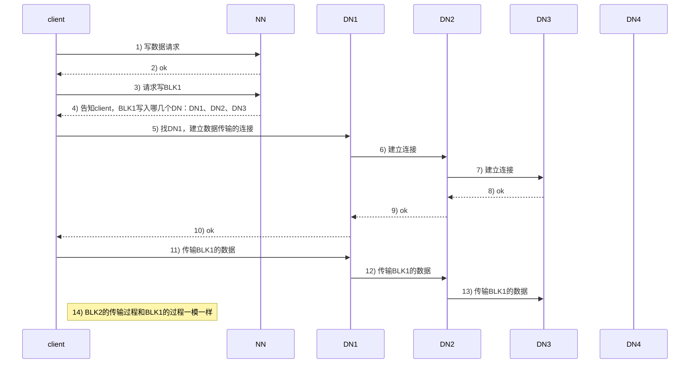

# HDFS写数据流程图解

```mermaid
sequenceDiagram
    participant A as client
    participant B as NN
    participant C as DN1
    participant D as DN2
    participant E as DN3
    participant F as DN4
    A->>B: 1) 写数据请求
    B-->>A: 2) ok
    A->>B: 3) 请求写BLK1
    B-->>A: 4) 告知client，BLK1写入哪几个DN：DN1、DN2、DN3
    A->>C: 5) 找DN1，建立数据传输的连接
    C->>D: 6) 建立连接
    D->>E: 7) 建立连接
    E-->>D: 8) ok
    D-->>C: 9) ok
    C-->>A: 10) ok
    A->>C: 11) 传输BLK1的数据
    C->>D: 12) 传输BLK1的数据
    D->>E: 13) 传输BLK1的数据
    Note right of A: 14) BLK2的传输过程和BLK1的过程一模一样
```
