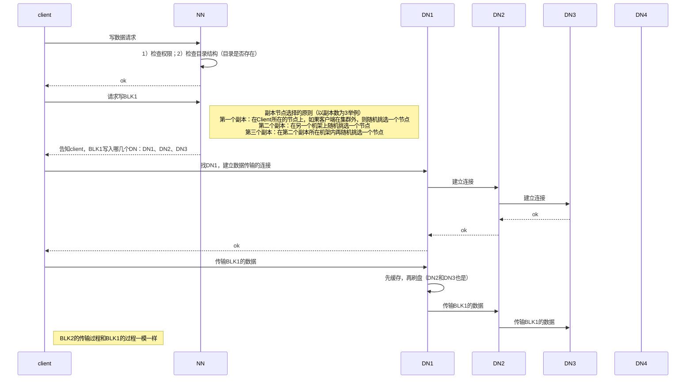

# HDFS写数据流程图解

```mermaid
sequenceDiagram
    participant A as client
    participant B as NN
    participant C as DN1
    participant D as DN2
    participant E as DN3
    participant F as DN4
    A->>B: 写数据请求
    B->>B: 1）检查权限；2）检查目录结构（目录是否存在）
    B-->>A: ok
    A->>B: 请求写BLK1
    Note right of B: 副本节点选择的原则（以副本数为3举例）<br>第一个副本：在Client所在的节点上，如果客户端在集群外，则随机挑选一个节点<br>第二个副本：在另一个机架上随机挑选一个节点<br>第三个副本：在第二个副本所在机架内再随机挑选一个节点
    B-->>A: 告知client，BLK1写入哪几个DN：DN1、DN2、DN3
    A->>C: 找DN1，建立数据传输的连接
    C->>D: 建立连接
    D->>E: 建立连接
    E-->>D: ok
    D-->>C: ok
    C-->>A: ok
    A->>C: 传输BLK1的数据
    C->>C: 先缓存，再刷盘（DN2和DN3也是）
    C->>D: 传输BLK1的数据
    D->>E: 传输BLK1的数据
    Note right of A: BLK2的传输过程和BLK1的过程一模一样
```
