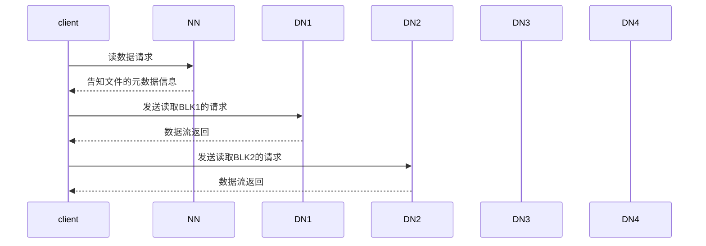

# HDFS读数据流程

```mermaid
sequenceDiagram
    participant A as client
    participant B as NN
    participant C as DN1
    participant D as DN2
    participant E as DN3
    participant F as DN4
    A->>B: 读数据请求
    B-->>A: 告知文件的元数据信息
    A->>C: 发送读取BLK1的请求
    C-->>A: 数据流返回
    A->>D: 发送读取BLK2的请求
    D-->>A: 数据流返回
```
