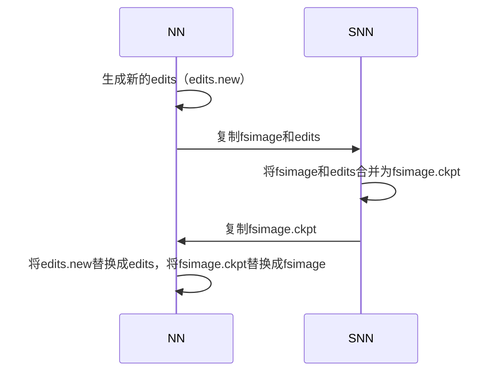

# SNN的Checkpoint流程

```mermaid
sequenceDiagram
    participant A as NN
    participant B as SNN
    A->>A: 生成新的edits（edits.new）
    A->>B: 复制fsimage和edits
    B->>B: 将fsimage和edits合并为fsimage.ckpt
    B->>A: 复制fsimage.ckpt
    A->>A: 将edits.new替换成edits，将fsimage.ckpt替换成fsimage
```
