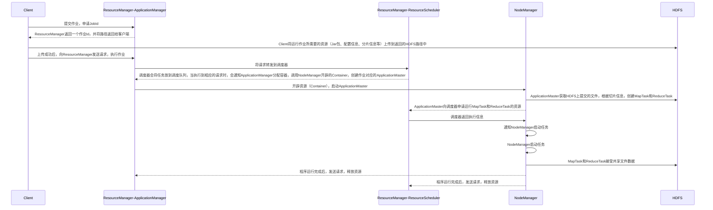

# YARN提交作业流程

```mermaid
sequenceDiagram
    participant A as Client
    participant B as ResourceManager-ApplicationManager
    participant C as ResourceManager-ResourceScheduler
    participant D as NodeManager
    participant E as HDFS
    A->>B: 提交作业，申请JobId
    B-->>A: ResourceManager返回一个作业Id，并将路径返回给客户端
    A->>E: Client将运行作业所需要的资源（Jar包、配置信息、分片信息等）上传到返回的HDFS路径中
    A->>B: 上传成功后，向ResourceManager发送请求，执行作业
    B->>C: 将请求转发到调度器
    C-->>B: 调度器会将任务放到调度队列，当执行到相应的请求时，会通知ApplicationManager分配容器，调用NodeManager开辟的Container，创建作业对应的ApplicationMaster
    B->>D: 开辟资源（Container），启动ApplicationMaster
    D->>E: ApplicationMaster获取HDFS上提交的文件，根据切片信息，创建MapTask和ReduceTask
    D-->>C: ApplicationMaster向调度器申请运行MapTask和ReduceTask的资源
    C->>D: 调度器返回执行信息
    D->>D: 通知NodeManager启动任务
    D->>D: NodeManager启动任务
    D->>E: MapTask和ReduceTask接受共享文件数据
    D-->>B: 程序运行完成后，发送请求，释放资源
    D-->>C: 程序运行完成后，发送请求，释放资源
```