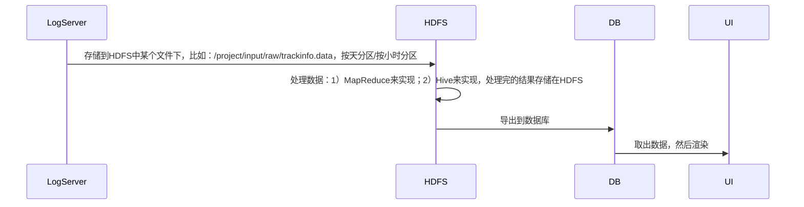

# 用户行为日志分析

```mermaid
sequenceDiagram
    participant A as LogServer
    participant B as HDFS
    participant C as DB
    participant D as UI
    A->>B: 存储到HDFS中某个文件下，比如：/project/input/raw/trackinfo.data，按天分区/按小时分区
    B->>B: 处理数据：1）MapReduce来实现；2）Hive来实现，处理完的结果存储在HDFS
    B->>C: 导出到数据库
    C->>D: 取出数据，然后渲染
```
