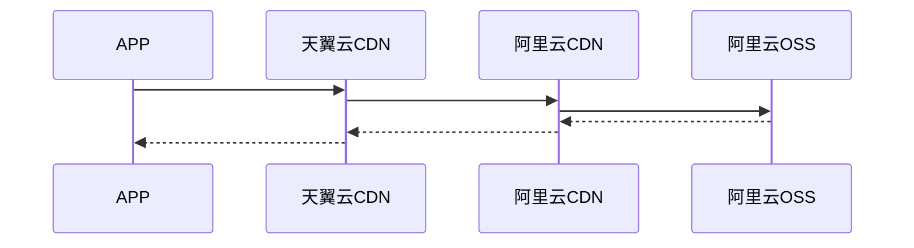

# 客户端获取资源的流程

```mermaid
sequenceDiagram
    participant A as APP
    participant B as 天翼云CDN
    participant C as 阿里云CDN
    participant D as 阿里云OSS
    A->>B: 
    B->>C: 
    C->>D: 
    D-->>C: 
    C-->>B: 
    B-->>A: 
```
